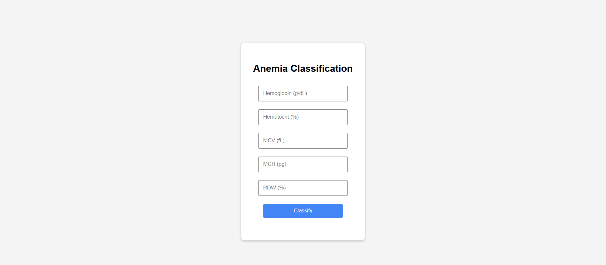
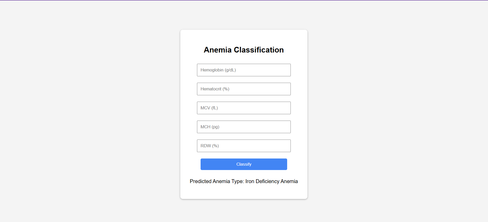

# Anemia Classification Using CBC Data

This project is a **Flask-based web application** that classifies anemia types based on Complete Blood Count (CBC) parameters.  
It leverages a **pre-trained machine learning model** to predict whether a patient is likely to have **No Anemia**, **Iron Deficiency Anemia**, or **Vitamin Deficiency Anemia**.

The solution combines data preprocessing, supervised machine learning, and an interactive web interface to provide **fast, accurate, and user-friendly predictions**.

---

## Project Overview

The goal of this application is to assist healthcare professionals or researchers in quickly interpreting CBC data to identify potential anemia conditions.  
The workflow includes:
1. **User Input:** CBC values are entered into a form.
2. **Model Prediction:** The pre-trained model processes the input data and returns the predicted anemia type.
3. **Result Display:** The prediction is shown in a clean and easy-to-read format.

---

## Key Features

- **Pre-trained ML Model:** Gradient Boosting Classifier trained with SMOTE to address class imbalance.
- **High Accuracy:** Achieved 93.2% accuracy on validation data.
- **Interactive Web Interface:** Built with Flask, allowing real-time predictions directly from the browser.
- **Ready-to-Use:** Includes a pre-trained model (`anemia_model.pkl`), eliminating the need for retraining before use.
- **Cross-Platform Support:** Can be run on Windows, macOS, and Linux.

---

## Technology Stack

**Languages & Frameworks:**
- Python
- Flask

**Data & Machine Learning:**
- Pandas, NumPy
- Scikit-learn
- Imbalanced-learn (SMOTE)

**Frontend:**
- HTML/CSS (Jinja2 templating)

---

## Project Structure
```
anemia-classification-cbc/
├── app.py               # Flask application entry point
├── train_model.py       # Script for model training
├── utils.py             # Helper functions for preprocessing
├── anemia_model.pkl     # Pre-trained machine learning model
├── requirements.txt     # Python dependencies
├── templates/
│   └── index.html       # Web interface template
└── static/
    └── style.css        # UI styling
```

---

## Screenshots

**Home Page**  
Displays a form for inputting CBC parameters.  


**Prediction Result**  
Shows the anemia classification output after submission.  


---

## Installation and Running Instructions

Follow these steps to set up and run the application locally.

### 1. Clone the Repository
```bash
git clone https://github.com/Harshavardhan36/Anemia-Classification.git
cd Anemia-Classification
```

### 2. Create a Virtual Environment (Optional but Recommended)

**Windows:**
```bash
python -m venv venv
venv\Scripts\activate
```

**Mac/Linux:**
```bash
python3 -m venv venv
source venv/bin/activate
```

### 3. Install Dependencies
```bash
pip install -r requirements.txt
```

### 4. Run the Application
```bash
python app.py
```

### 5. Open the Application in a Browser
Navigate to:
```
http://127.0.0.1:5000/
```

---

## Usage Instructions

1. Launch the application and open the home page.
2. Enter the following CBC parameters:
   - Hemoglobin (g/dL)  
   - Hematocrit (%)  
   - MCV (fL)  
   - MCH (pg)  
   - RDW (%)
3. Click **Classify**.
4. The application will display the predicted anemia type based on the input data.

---

## Retraining the Model (Optional)

If you wish to train the model from scratch using a dataset:
```bash
python train_model.py
```
This will regenerate the `anemia_model.pkl` file with the new trained model.

---

## License

This project is released under the MIT License.  
You are free to use, modify, and distribute it as per the license terms.

---

## Author

**Sri Harshavardhan Pulluru**  
- [LinkedIn](https://www.linkedin.com/in/harshavardhan3636/)  
- [GitHub](https://github.com/Harshavardhan36)
